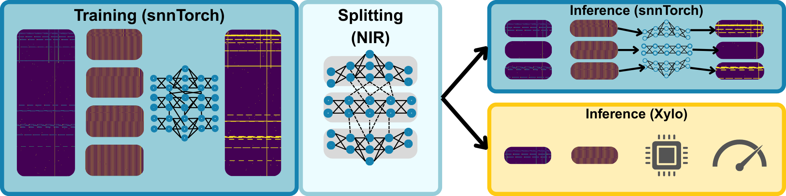

# Maximal Split
This work demonstrates the training and splitting of SNNs for RFI detection in radio astronomy for inference on SynSense
Xylo hardware. 
Training in snnTorch, model manipulation in NIR before inference in Rockpool/Xylo demonstrates the usefuless of 
recently developed interoperability tools.
Energy estimates and on-hardware inference (if available) show power consumption per-chip of ~250 micro-watts.

This codebase provides the ability to search for hyperparameters, train models, perform splitting and estimate energy usage. 

## Introduction

### Key Components

- Supervised training of SNNs for RFI detection in radio astronomy with latency encoding
- Maximal splitting algorithm for model sharding in NIR format
- Combined inference in snnTorch or deployment to SynSense Xylo hardware (if available)

### System Overview



Overall methodology for RFI detection with spiking neural networks trained as a large single model and then split for inference on several neuromorphic chipsets. Spectrograms are split and latency encoded before feeding through the SNN, models are split in NIR format and deployed in snnTorch or to SynSense Xylo hardware for power measurement.

## Code Structure
We outline several important files in the code-structure below
```
data/
├── HERA-21-11-2024_all_delta_norm.pkl # [Available online](https://zenodo.org/records/14676274)
src/
├── data/
│   ├── data_loaders.py  # Contains files that read in raw data
├── hardware/
    ├── conversion_example.py  # Contains Xylo deployment code from NIR, includes a small stand-alone example
├── hpc/
    ├── generate_runfiles.py  # Generates slurm-scripts for HPC environment
├── interfaces/
    ├── # Various boilerplate interfaces used elsewhere
├── models/
    ├── fc_latency.py  # Original sized SNN model for training
    ├── fc_multiplex.py  # Lightning model comprised of several split snnTorch models
    ├── fc_hivemind.py  # Lightning model comprised of several split Rockpool models
├── post-processing/
    ├── energy_estimates.py  # Code to generate energy estimates from analytical model
    ├── trial_results_processing.py  # Code to generate performance summaries from repeat snnTorch trials
    ├── xylo_measurement_collection.py  # Code to generate performance summaries from repeat Xylo trials
├── config.py  # Contains training hyper-parameters
├── evlauation.py  # Contains boilerplate to run through and plot results post-training
├── generate_plots.py  # Generates rasters of spike encodings
├── main.py  # Main training file
├── optuna_main.py  # Main training file for optuna hyper-parameter trials
```
## Setup

### Creating a venv environment
```bash
python3 -m venv venv && source venv/bin/activate && pip install -r requirements.txt
```

### NB: Adjustments to NIR modules

There is a slight inconsistency with how snnTorch writes out `tau_syn` and `tau_mem` values and how Rockpool reads them
in from NIR. The fix is to manually override the read-in code on Rockpool's side to force a `dt=1e-4`, instead of inferring
this value for each neuron.

The file in question will be

`.venv/lib/python3.10/site-packages/rockpool/nn/modules/torch/nir.py`

With the adjustment at line `126`
```python
return LIFTorch(
    shape=_to_tensor(node.input_type["input"]),
    tau_mem=_to_tensor(node.tau_mem),
    tau_syn=_to_tensor(node.tau_syn),
    threshold=_to_tensor(node.v_threshold),
    # dt=torch.min(
    #     torch.as_tensor(_to_tensor(node.tau_mem / (1 + node.r)))
    # ).item(),
    dt = 1e-4,
    bias=_to_tensor(node.v_leak),
)
```

### Dataset setup
You will need to download a copy of the delta-normalized HERA dataset, [available from Zenodo](https://zenodo.org/records/14676274)

The `HERA-21-11-2024_all_delta_norm.pkl` file should be moved into `./data`, as depicted above.

## Training
For the purposes of this readme, we provide scripts to reproduce a complete trial from training, splitting and energy estimates.
`hpc/generate_runfiles.py` can generate a complete set of slurm scripts to run all repeat trials; although this will be 
exhaustive.

We have provided a pre-trained example model, which will be used by default (trial 0).

To train:

`python ./src/main.py`

To perform split inference

`python ./src/splitter_main.py`

Which will generate a separate `./lightning_logs/` file within the directory for each of the splitting methods.

To generate energy estimates

`python ./src/post-processing/energy_estimates.py`

Which will produce a file containing a json of results with several following fields:
```
- flops_per_layer               # The estimated FLOPs per network layer
- spike_rates                   # The measured spike rates per layer 
- energy_per_layer (J)          # Energy consumed per layer per inference
- flops_per_layer_patch         # Flops per layer per spectrogram patch 
- energy_per_layer_patch        # Energy per layer per spectrogram patch
- spike_rates_patch             # Spike rates per layer per spectrogram patch
- flops_per_patch               # Flops over the network per spectrogram patch
- energy_per_patch (J)          # Energy consumed over the network per spectrogram patch
- num_patches                   # Number of simultaneous chips required to infer over whole spectrogram
- total_clock_steps             # Total number of clock ticks required for a total spectrogram (takes into account encoding length)
- energy_per_spectrogram (J)    # Total energy per spectrogram  
- total_time_default (s)        # Total time required to infer a spectrogram at the default clockspeed
- default_clock_speed (Hz)      # The default clock speed of the Xylo hardware (50MHz)
- total_time_min_rate (s)       # Total time required to infer a spectrogram at the slowest clock speed possible to match instrument integration time (3.52s)
- min_clock_speed (Hz)          # Clock speed to match total_time_min_rate
- watts_defualt (W)             # The estimated power usage at the default clock speed
- watts_min (W)                 # The estimated power usage at the lowest possible clock speed
```

The main results being the `watts_default` and `watts_min`.
If by chance, Xylo hardware is available, run the following to generate power estimates with real hardware:

```bash
export ROCKPOOL=True
python ./src/post-processing/energy_estimates.py
```

These examples assume no prior training runs and default directory locations of `./lightning_logs/` and `./data` for the
output files and data directory respectively. Adjustment of parameters in these respective files may be necessary if
this is not the case.

## License

This project is licensed under the MIT License - see the LICENSE file for details.
